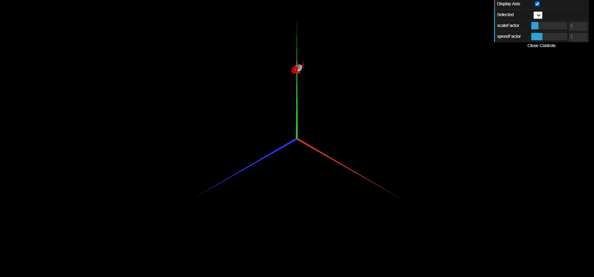

# CGRA 2020/2021

## Group T07G03

## Project Notes

### Part A

#### 1. Moving Object

- In this part we learned how to detect user input from the keyboard to affect our scene.
- We also learned how to create movable objects that change position and orientation over time.

#### 2.1. MyCubeMap

- In this part, we adapted the code from MyUnitCubeQuad (TP4) to produce a new class, MyCubeMap, as specified in the instructions.
- However, as we noticed the code from the original MyUnitCubeQuad could be vastly improved, we decided to improve that class and then adapt it into the MyCubeMap. Both classes are present in the project folder.
- The main differences between a MyCubeMap and a MyUnitCubeQuad is the material (MyCubeMap has the properties specified in the instructions of the project), the size (MyCubeMap has a scale factor of 500) and the faces of MyCubeMap pointing inwards (implemented as a 180 degrees rotation around the X or Y axis, depending on the face).
- We used a scale factor of 500 for MyCubeMap, instead of the instructed 50, so that objects weren't clipped outside the cube in certain perspectives.
- We improved the code of MyUnitCubeQuad.js from the TP4 (the improved version can be seen in the file MyUnitCubeQuad.js of the project folder) before using the code to create MyCubeMap.js.

#### 2.2. MyCylinder

- In this part we created a new class MyCylinder with the properties specified in the instructions (radius and height with value 1; the base of the cylinder is in the plane XZ and centered at the origin).
- We also added texture coordinates and used the file images/earth.jpg to debug the object.

#### 2.3. MySphere

- In this part we experimented displaying the sphere in the scene and studied its source code in order to understand how it was created. We concluded that each stack is created with all its slices before going to the next stack.
- We decided the place where it makes the most sense to add the textureCoordinates of a vertex is right after adding the respective vertex coordinates. The phi angle ranges from 0 to pi and should be associated with the y coordinate of the texture, as it represents latitude. On the other hand, theta ranges from 0 to 2*pi and should be associated with the x coordinate of the texture, as it represents the longitude. As the texture coordinates should range from 0 to 1, we can divide each angle by the maximum value in its range.

#### 3. Interface

- We renamed the textures in the folder images/test_cubemap so that they had the same name as the other cubemaps, in order to be able to use a for loop that loads all textures.
- In order to change the scaleFactor of the moving object without changing its position, we had to scale it inside the display function. As such, we created a scaleFactor parameter in the moving object that was updated when the user changes its value in the slider.

#### 4. MyFish

- To create the shader for the fish body, we based it on the 'doubletext' shader from TP5. The main differences are: distortion of the sphere in the fish_body shader, we used the aVertexPosition to split the head and body rather than gl_Position (so as not to depend on the camera position nor on the distortion), and a texture was used for the body instead of another solid color.
- Because the sphere (without distortion) has a diameter of 2, 40% of it is 0.8: this is the size we chose for the head (the body is 1.2). Because the sphere is centered at the origin, this corresponds to a split at z=0.2.
- We created the fins and tails by applying geometric transformations to a double-sided triangle and used a material with the same color as the body.
- For the eyes we used a sphere with a texture created by us (fisheye.png) and applied geometrical transformations to it.
- The whole fish is scaled by a factor of 0.5/(2*zDistortion), where zDistortion=1.6 is the amount of distortion in the z axis we applied to the unit radius sphere. This factor is used so that the length of the fish in scene is around 0.5 units.
- In order to animate fins and tail, we created the MyFish.updateAnimation() function, called in MyScene.update() to pass to the fish the current time. This time is used to calculate a rotation state based on constant parameters such as the fins/tail velocity and initial phase. We used the cossines of this rotations states to calculate the angles so that the animation is periodic. The tail moves between angles +-Math.PI/9 where angle 0 is when the tail is at the center. The fins move (each in its direction) between Math.PI/10 and (Math.PI/10+Math.PI/5), where angle 0 is when the fins are pointing downwards.

#### 5.1 Sea floor and fish nest

- In this part, we based it in the 'texture3' shader from TP5. We had to create a plane with textures using an image with the colors ('sand.png') and an image with the map of height to create a sensation of ondulation ('sandMap.png'). 
- Based on the intensities of the height's map, we added a displacement to the position of each point of the surface.
- In order to have a limit for the height displacement, we had to pass a variable to the vertex shader so as to prevent that the sand's surface would not surpass the plane Y=1;
- TODO: SOMBREAMENTO
- To create the fish nest, we added an image of a shell('shell.png') to the image of the colors('sand.png'), keeping in mind the maximum radius asked of 5 units.
- For the ondulation of the floor to match the existence of the shell, we also added, in the same position, a lighter zone to the height's map so as to create a hole. 

TODO: SOMBREAMENTO + LIGHTER ZONE FOR THE SHELL?

#### 5.2 Water surface

#### 5.3 Rocks

#### 5.4 MyPillar, cubemap and MySeaweed

## Screenshots

### 1 - MyFish

